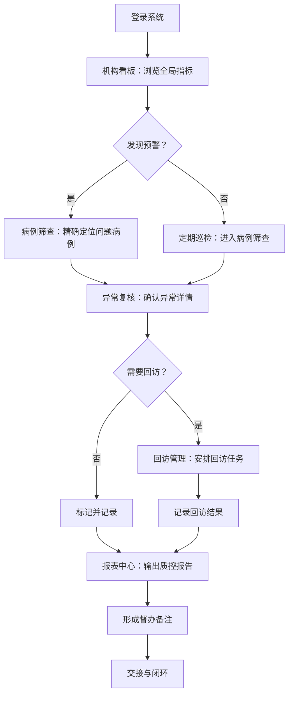

## 1. 产品概述

连锁口腔正畸质控监管平台，面向连锁口腔机构的运营主管和质控负责人，核心目标是盯住大量正畸方案是否按标准推进，实现多门店统一监督，减少项目推进失控。区别于单病例管理工具，本产品聚焦于批量数据筛查、异常识别和督办闭环。

- 目标用户：连锁口腔机构运营主管、质控负责人
- 核心价值：将散落在各门店的正畸治疗数据汇聚为可监管、可追踪、可交接的质控闭环

## 2. 核心功能

### 2.1 用户角色

| 角色 | 职责范围 | 核心权限 |
|------|----------|----------|
| 运营主管 | 多门店整体运营监督 | 查看所有门店数据、安排回访任务、导出报表 |
| 质控负责人 | 治疗质量与合规把控 | 审核异常病例、督办整改、输出质控清单 |

### 2.2 功能模块

1. **机构看板**：在治患者分布、门店/医生维度的关键指标概览、超期未复诊预警
2. **病例筛查**：多条件组合筛选、多次改方案高风险病例、各阶段平均耗时分析
3. **异常复核**：附件丢失/托槽脱落集中点、复诊记录完整度抽查、关键节点照片缺失检查
4. **回访管理**：运营回访任务安排、患者满意度与退费倾向记录、门店依从性对比
5. **报表中心**：月度质控清单输出、督办备注形成与交接、多维度数据导出

### 2.3 页面详情

| 页面名称 | 模块名称 | 功能描述 |
|----------|----------|----------|
| 机构看板 | 门店概览卡片 | 按门店展示在治人数、本月新增、超期未复诊数、异常标记数 |
| 机构看板 | 医生分布视图 | 按医生展示在治患者数量、方案变更次数、平均复诊间隔 |
| 机构看板 | 趋势图表 | 在治人数趋势、超期复诊趋势、附件/托槽异常趋势 |
| 机构看板 | 预警滚动条 | 实时滚动展示超期未复诊、方案多次变更等预警信息 |
| 病例筛查 | 筛选条件面板 | 按门店、医生、治疗阶段、复诊状态、方案变更次数等组合筛选 |
| 病例筛查 | 病例列表 | 展示筛选后的病例表格，支持排序和分页 |
| 病例筛查 | 阶段耗时分析 | 各阶段平均耗时对比图，标注偏离标准值的阶段 |
| 病例筛查 | 高风险病例标识 | 多次改方案、超期过长等病例高亮标记 |
| 异常复核 | 附件/托槽异常地图 | 按门店和医生展示附件丢失和托槽脱落的集中发生点 |
| 异常复核 | 复诊记录抽查 | 随机抽查复诊记录完整度，标记缺项记录 |
| 异常复核 | 照片缺失检查 | 关键节点（如戴牙套、更换弓丝）照片是否缺失的检查列表 |
| 异常复核 | 异常详情弹窗 | 点击异常条目弹出详细信息及历史记录 |
| 回访管理 | 回访任务列表 | 运营回访任务分配与状态追踪 |
| 回访管理 | 回访记录表单 | 记录回访结果：满意度评分、退费倾向、沟通备注 |
| 回访管理 | 门店依从性对比 | 各门店患者依从性指标对比图表 |
| 回访管理 | 回访统计概览 | 回访完成率、平均满意度、退费率等汇总指标 |
| 报表中心 | 月度质控清单 | 自动生成月度质控检查项清单，含达标/未达标标注 |
| 报表中心 | 督办备注管理 | 可交接的督办备注，支持指派、跟进、关闭 |
| 报表中心 | 数据导出 | 多维度数据导出为 Excel/PDF |
| 报表中心 | 历史报表归档 | 按月查看历史质控报表 |

## 3. 核心流程

**日常质控监管流程**：运营主管登录后，先在机构看板浏览全局指标，发现预警后进入病例筛查精确定位问题病例，对异常病例进行复核确认，安排回访任务跟进，最终在报表中心输出质控报告和督办事项。

## 4. 用户界面设计

### 4.1 设计风格

- **主色调**：深蓝灰（#1E293B）为底色，搭配青蓝（#06B6D4）为数据高亮色，橙红（#F97316）为预警强调色
- **按钮风格**：圆角矩形，填充式主操作按钮 + 描边式次操作按钮
- **字体**：标题使用 DM Sans（粗体），正文使用 Noto Sans SC（常规体）
- **布局风格**：左侧固定导航栏 + 右侧内容区，内容区内采用卡片式网格布局
- **图标风格**：线性图标（Lucide），与文字搭配使用
- **整体气质**：数据驱动、专业严谨、信息密度高但层次清晰

### 4.2 页面设计概览

| 页面名称 | 模块名称 | UI 元素 |
|----------|----------|---------|
| 机构看板 | 门店概览卡片 | 深色卡片 + 数字高亮，4列网格布局，hover 微浮起效果 |
| 机构看板 | 医生分布视图 | 可切换表格/卡片视图，医生头像 + 关键指标数字 |
| 机构看板 | 趋势图表 | 折线图 + 柱状图组合，深色背景半透明填充 |
| 机构看板 | 预警滚动条 | 顶部横向滚动条，橙红色背景，自动轮播 |
| 病例筛查 | 筛选条件面板 | 左侧折叠式筛选面板，多选标签 + 范围选择器 |
| 病例筛查 | 病例列表 | 深色表格，行 hover 高亮，高风险行左侧红色标记 |
| 病例筛查 | 阶段耗时分析 | 横向条形图，超标阶段标橙红 |
| 异常复核 | 附件/托槽异常地图 | 热力矩阵图，行列分别为门店和时间段，颜色深浅表示异常密度 |
| 异常复核 | 复诊记录抽查 | 卡片列表，完整度进度条 + 缺项红色标记 |
| 异常复核 | 照片缺失检查 | 时间轴布局，缺失节点红色虚线框标记 |
| 回访管理 | 回访任务列表 | 看板式拖拽列（待办/进行中/已完成），任务卡片含优先级色标 |
| 回访管理 | 回访记录表单 | 模态弹窗表单，星级评分 + 下拉选择 + 文本域 |
| 回访管理 | 门店依从性对比 | 雷达图 + 排名列表，多维度对比 |
| 报表中心 | 月度质控清单 | 结构化表格，达标绿色勾/未达标红色叉，支持展开详情 |
| 报表中心 | 督办备注管理 | 时间线 + 状态标签（待处理/跟进中/已关闭），可指派人员 |
| 报表中心 | 数据导出 | 导出按钮组，格式选择 + 范围选择 |

### 4.3 响应式策略

- 桌面端优先设计，最小支持 1280px 宽度
- 内容区采用弹性网格，宽屏自动扩展列数
- 图表组件自适应容器宽度
- 不做移动端适配（管理场景以桌面为主）

### 4.4 动效设计

- 页面切换：淡入淡出
- 数据加载：骨架屏占位
- 卡片交互：hover 微浮起 + 阴影加深
- 预警信息：脉冲呼吸动画
- 图表渲染：数值递增动画
