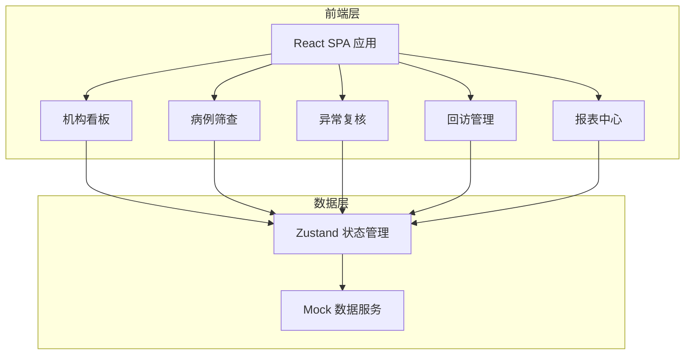
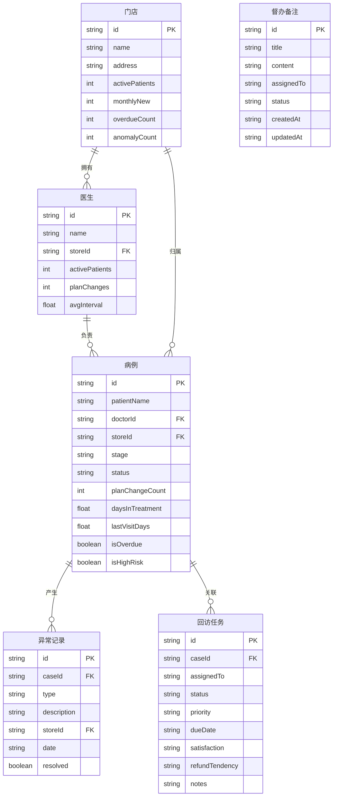

## 1. 架构设计

## 2. 技术说明

- **前端**：React@18 + TypeScript + Tailwind CSS@3 + Vite
- **初始化工具**：vite-init (react-ts 模板)
- **后端**：无后端，使用 Mock 数据
- **数据库**：无数据库，前端内置模拟数据
- **状态管理**：Zustand
- **图表库**：Recharts
- **图标库**：lucide-react
- **路由**：react-router-dom v6

## 3. 路由定义

| 路由 | 用途 |
|------|------|
| / | 重定向到 /dashboard |
| /dashboard | 机构看板，全局指标概览与预警 |
| /screening | 病例筛查，多条件筛选与高风险病例识别 |
| /review | 异常复核，附件/托槽异常、复诊记录抽查、照片缺失检查 |
| /followup | 回访管理，任务安排与满意度记录 |
| /reports | 报表中心，月度质控清单与督办备注 |

## 4. 数据模型

### 4.1 数据模型定义

### 4.2 数据定义

本项目采用前端 Mock 数据，数据定义在 `src/utils/mockData.ts` 中，包含：
- 5 个门店的基础数据
- 20 名医生的在治数据
- 200+ 病例的模拟数据（含不同阶段、状态、风险等级）
- 50+ 异常记录（附件丢失、托槽脱落、照片缺失等类型）
- 30+ 回访任务
- 月度质控清单模板数据
